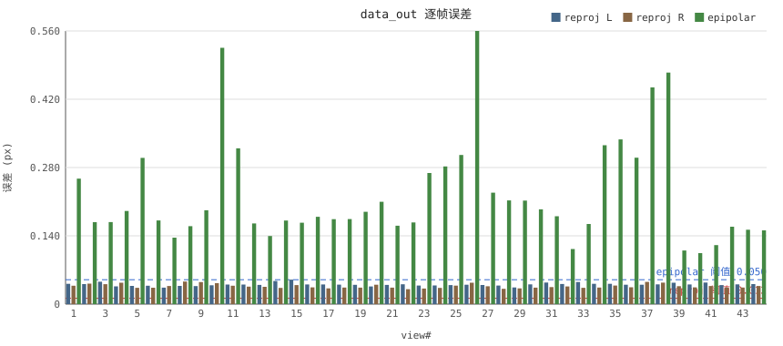
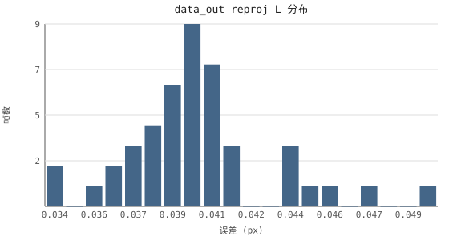

# 相机标定分析报告

- 生成时间：2026-10-04 18:52:41
- 输入：1 个

## 指标说明

### 门禁与总评

| 指标 | 通俗含义 |
|---|---|
| verdict | 全部门禁通过=PASS / 有观察项=WARN / 有未过项=FAIL |
| N/A | 该项不可测或数据缺失（如无棋盘 config 时几何类指标） |
| reproj_mean | 平均重投影误差(px)——标定参数把棋盘角点「投影回」图像与实测角点的平均偏差，越小内参越准 |
| epipolar_mean | 平均极线误差(px)——左图角点经双目位姿换算后偏离右图极线的平均距离，检验外参（双目相对位姿） |
| stereoRms | 双目整体重投影 RMS(px)，内参＋外参联合误差 |
| skipped_pct | 角点提取失败被跳过的帧占比 |
| 基线 \|T\| | 双目两相机光心的物理间距（mm），跨批应稳定 |
| table:* | 温度补偿表存在性与档数检查（应为 61 档） |

### 逐帧分布

| 指标 | 通俗含义 |
|---|---|
| reprojL / reprojR | 每帧左/右相机的重投影误差 |
| P50 / P90 | 一半 / 90% 的帧低于该值，P90 更能反映最差的那批帧 |
| std | 帧间波动，越大越不整齐 |

### 一致性

| 指标 | 通俗含义 |
|---|---|
| 焦距Δ% | 左右焦距相对差，同型号镜头应接近 |
| 主点偏离 | 光心离图像中心的像素距离，过大提示装配或拟合问题 |
| validRoi 覆盖 | 立体矫正后有效画面占比，越大越好 |

### 离群帧

| 指标 | 通俗含义 |
|---|---|
| view# | 跳帧后重排的有效帧序号（1 起），不等于原始文件编号 |
| IQR / medSigma3 / TOP5 | 三种找坏帧方法（箱线 / 3σ / 最差5帧），≥2 法命中=稳定离群 |
| 距离mm | 该帧棋盘到相机的拍摄距离 |
| 斜角° | 棋盘平面与光轴夹角，越斜越难测准 |
| 覆盖% | 棋盘占画面面积比，太小则角点像素不足 |
| L-R比 | 左右误差之比，偏离 1 表示单侧劣化 |
| 双差 | 重投影与极线误差都大=该帧本身质量差 |

### 相关性

| 指标 | 通俗含义 |
|---|---|
| corrDist / corrAngle / corrCoverInv | 误差与距离/斜角/覆盖的关系强度（-1~1），绝对值越大越相关 |
| 星号 | 显著性——* p&lt;0.05，** p&lt;0.01，. p&lt;0.10（弱证据），无星=可能只是巧合 |
| 偏相关 | 剔除干扰因素后的净关系（如去掉距离影响的纯边缘效应） |
| corrFrameIdx | 误差随拍摄顺序的趋势，强相关提示采集期漂移（如热漂） |
| 偏度/峰度 | 分布形态——偏度&gt;0 有坏帧长尾；峰度高=厚尾，极端误差帧偏多 |
| fxFyPct | 焦距纵横比差，应接近 0 |

### 标定可信度

| 指标 | 通俗含义 |
|---|---|
| 帧数≥10 | OpenCV 实践门槛，太少解不稳 |
| 姿态方向 | 棋盘至少两个朝向，单一朝向方程病态 |
| 宫格角落 | 棋盘须拍到画面边角，否则边缘畸变欠约束 |
| 参考量级 | 良好制作下典型重投影误差约 0.1px（BoofCV 经验值）；门禁阈值仍以 config 为准 |

### 双目一致性

| 指标 | 通俗含义 |
|---|---|
| L-R差值 std | 同帧左右误差差的波动，大=两相机表现不一致 |
| corrLR | 左右误差同帧相关，高=坏帧是全局的（光照/棋盘问题） |
| corrReprojEpi | 内参×外参误差相关，≈0 说明两者不同源 |
| β | 距离-误差斜率——≈-1 纯板尺寸效应 / ≈0 像素噪声主导 / &gt;0 越远越糊（对焦可疑）；robust=剔除杠杆帧后值；⚠杠杆敏感=结果受个别帧影响大 |
| 失衡帧 | 左右误差比 &gt;1.5 或 &lt;0.67 的帧 |

### 批次间投影差异

| 指标 | 通俗含义 |
|---|---|
| maxPx / meanPx | 两批参数对同一画面点投影位置的最大/平均偏差 |
| kOnlyMaxPx | 只换 K 不换畸变的偏差——分辨差异来自 K 还是畸变 |
| 一致性指示器 | 只说明「两批参数差多少」，不能区分镜头变化/拟合波动/参数漂移 |
| Δ vs 首列 | 与第一个输入批次相比的百分比变化（首列自身为 N/A） |
| 高误差 view 重现 | 两批按 view# 对齐后，同名帧在两批都超过各自 P90——重现提示系统性问题 |
| Δfx%/Δcx/Δcy/Δk1~k3/Δp1/Δp2 | 两批参数逐项增量（焦距%/主点/径向/切向畸变系数） |

### 指纹

| 指标 | 通俗含义 |
|---|---|
| R1~R8 | 八类常见问题特征判定（对焦不一致/覆盖不足/远距小板/外参嫌疑/单相机劣化/全局场景/热漂/数据病态） |
| 判定标记 | ⚠命中 / —排除 / ? 证据不足；「初步重现」=2-3 批线索级，≥4 批结论级 |

## data_out

- 文件：`../../tests/e2e/data_out/CESHI260831-2_camera_calib.json`
- schema：factory_calib.camera_calib.v1
- 参考温度：22.5 °C
- 帧：input 44 / valid 44 / 跳过 0.0%
- 基线 |T|：133.14 mm
- 阈值：reproj ≤ 0.012（default），epipolar ≤ 0.05（default）
- 综合判定：**FAIL**

### 质量指标

| 指标 | 值 | 阈值 | 判定 |
|---|---|---|---|
| reproj_mean | 0.0385 | ≤ 0.012 | FAIL |
| epipolar_mean | 0.2246 | ≤ 0.05 | FAIL |
| skipped_pct | 0.0% | ≤ 10% | PASS |

### 分布（per-view）

| 序列 | n | min | P50 | P90 | max | mean | std |
|---|---|---|---|---|---|---|---|
| reproj L | 44 | 0.0338 | 0.0400 | 0.0442 | 0.0503 | 0.0402 | 0.0031 |
| reproj R | 44 | 0.0307 | 0.0356 | 0.0438 | 0.0463 | 0.0368 | 0.0042 |
| epipolar | 44 | 0.1045 | 0.1795 | 0.3340 | 0.5597 | 0.2246 | 0.1064 |

### 一致性

- 焦距：L 1837.81 px / R 1833.60 px（Δ 0.23%）
- 主点偏离中心：L 28.38 px / R 54.29 px
- validRoi 覆盖：L 45.1% / R 45.1%

### 离群帧

> view# 为跳帧后 valid 序号（1 基），≠原始帧号。

- IQR（1.5×IQR）：N/A
- medSigma3（median±3σ）：15
- TOP5：15, 14, 8, 3, 37
- 稳定离群（≥2 法命中）：15

| view# | reprojL | reprojR | epi | 距离mm | 斜角° | 覆盖% | L-R比 | 双差 |
|---|---|---|---|---|---|---|---|---|
| 15 | 0.0503 | 0.0390 | 0.1669 | N/A | N/A | N/A | 1.29 | 否 |
| 14 | 0.0473 | 0.0332 | 0.1713 | N/A | N/A | N/A | 1.42 | 否 |
| 8 | 0.0374 | 0.0463 | 0.1597 | N/A | N/A | N/A | 0.81 | 否 |
| 3 | 0.0459 | 0.0409 | 0.1681 | N/A | N/A | N/A | 1.12 | 否 |
| 37 | 0.0397 | 0.0456 | 0.4440 | N/A | N/A | N/A | 0.87 | 是 |

### 相关性

- corrDist（误差~距离（左目））：N/A
- corrAngle（误差~斜角（左目））：N/A
- corrCoverInv（误差~覆盖取负（左目））：N/A
- corrFrameIdx（误差~帧序(最大侧)）：-0.0363（p=0.8149）
- corrDistPartial（误差~距离 | 控制斜角）：N/A
- corrEdgePartial（误差~斜角 | 控制距离）：N/A
- 偏度：L 0.8382 / R 0.8371 / max(L,R) 0.5176
- 峰度（超额）：L 1.5975 / R -0.3807 / max(L,R) 0.3029
- fx-fy 差：L 0.006% / R 0.008%
- 可用样本 n：44

### 标定可信度

- 帧数：N/A（no board config）
- 姿态方向多样性：N/A（no board config）
- 宫格覆盖：N/A（no board config）
- 综合判定：N/A
- 参考量级：良好制作下典型重投影误差约 0.1px（BoofCV 经验值）

### 双目一致性

- L-R 逐帧差：mean 0.0035 px / std 0.0053 px
- corrLR（L~R）：-0.0555（p=0.7206）
- corrReprojEpi（max(L,R)~极线误差）：0.0747（p=0.6299）
- βL：β=-0.140 (robust -0.179) / βR：β=-0.137 (robust -0.168)
- 失衡帧（L/R 比 >1.5 或 <0.67）：左差 0 / 右差 0 / 共 0 帧（0.0%）
### 共性问题指纹（规则库 v1）

| 规则 | 判定 | 证据摘要 |
|---|---|---|
| R1 双目对焦/距离响应不一致 | — | βL=-0.140 βR=-0.137 |
| R2 姿态覆盖不足 | ? 证据不足 | 覆盖审计不可测（no board config） |
| R3 远距小板亚像素不足 | ? 证据不足 | corrDist 缺失（geo 缺失） |
| R4 外参/装配嫌疑 | ⚠命中 | epi/reproj=5.84 corrReprojEpi=+0.075 |
| R5 单相机劣化 | — | 失衡0.0% 左0/右0 |
| R6 全局场景问题 | — | corrLR=-0.055 |
| R7 采集期热漂 | — | corrFrameIdx=-0.036 |
| R8 数据量/姿态病态 | ? 证据不足 | 姿态多样性不可测（geo 缺失） |

阈值为一期经验值（实证 n=4 批）

### 物理检查清单（覆盖审计未过/不可测，请人工核查）

- [ ] 标定板平整度与刚性（翘曲会降低精度——BoofCV/mrcal 均强调）
- [ ] 双相机对焦与光圈一致性
- [ ] 漫射均匀光照、无眩光无硬阴影
- [ ] 棋盘格清洁无反光

